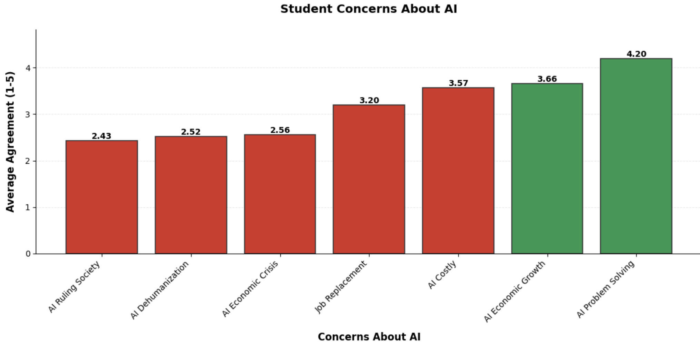

# Student Perception of AI in Education
This is a small exploration of how AI is viewed by students in the education system. 
AI use has exploded in academic settings, and currently public data is somewhat limited on its objective usage so small surveys such as the one that is studied in this project are important





## Data
The data used is from a 16-question survey on the student perception of AI at the Faculty of Cybernetics, Statistics, and Economic Informatics in Romania. 
Its data can be found [on Kaggle here.](https://www.kaggle.com/datasets/gianinamariapetrascu/survey-on-students-perceptions-of-ai-in-education/data)

The sample size was relatively small at 91, as responses came from students at one small academic institution. Insights can still be made using this data and give us an idea of what young academics think of artificial intelligence. 

## Setup
We are using poetry to manage our environment, so to run the Jupyter Notebook project using that environment, you must first make a Jupyter kernel using the poetry environment defined. 
After you navigate to the project root directory, to create a jupyter kernel run:
```bash
poetry run python -m ipykernel install --user --name=<my-kernel-name>
```

After the kernel is created, open your Jupyter environment of your choice and select the newly created kernel that defines our environment. From here, you can run the notebook as normal, assuming you have downloaded the data to the root directory. As a reminder that dataset [can be found here on Kaggle.](https://www.kaggle.com/datasets/gianinamariapetrascu/survey-on-students-perceptions-of-ai-in-education/data)


## The Analysis and Questions 
In the notebook the polars package was used for managing and transforming the data and primarily matplotlib visualizations helped to answer some of our questions of the dataset. 

The targeted questions we asked and answered in the notebook were: 
1. Generally how informed do students seem to be about AI?
2. Do students of different academic performance seem to think of AI differently?
3. What are students most concerned about when it pertains to AI?
4. What industries do students think AI will impact the most?
5. How do students think AI will impact learning and education?

### Some Conclusions and Next Steps
It seems overall that the students surveyed were relatively positive and optimistic towards artificial intelligence. They seem to believe that there will be greater problem solving capability as a result of it and that the impacts will be made in more academic disciplines like medicine and education. Most students claim to be well informed and seem to be learning about AI primarily through the internet and social media. 

It is important for future work to study the use of AI by students as well as their perspective on the technological shift as it could be a part of forging their educational and career paths. These have important societal and economic effects as technical workers further adopt AI tools. 


